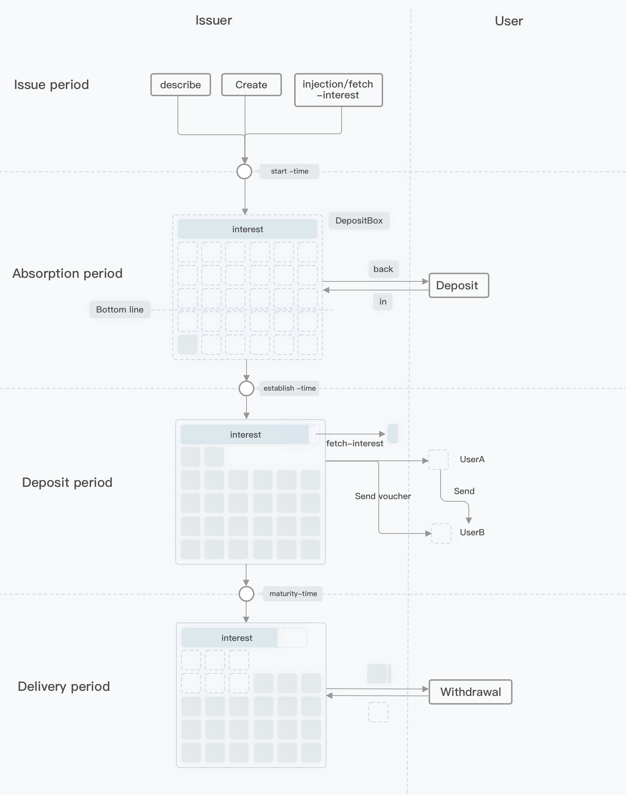

# Desposit HRC2 存款协议模块

## 简介
金融机构进行存款或期货交易。
## 描述
Hashgard 提供原生的存款服务协议。帮助金融机构进行流通资产的控制与管理。帮助金融机构通过适当的金融激励来稳定市场的经济与繁荣。为用户的金融行为提供更多的激励。

任何人都可以发行存款盒子，来达到发行者的金融目的。存款盒子的利息需要事先全额支出，整个存款盒子是存在于 Hashgard 系统中，不属于任何人，只有发行者在盒子设定的结束时间才能取回剩余利息。用户在盒子存款计息开始之前和存款盒子结束时间之后可以取回自己的本金和利息。发行者可以设置吸纳存款的种类，存款盒子的大小，开始时间，结束时间，计息所需要的达成的总体存款的最低额度。以及发放的利息的通证种类和数量。发行者可以设置用户持有的存款凭证是否可以进行交易。

## 存款时期

### 1. Issue period
- 发行者发行存款盒子，设定好存款的必要参数和利息注入。在 `start-time` 之前注入设定的利息数量。到达start-time进入存款吸纳期。
- 如果利息在 `start-time` 时不足存款盒子达成失败，发行者需要使用 `interest-fetch` 取回利息 。
- 利息注入可以由多个账户注入。此期间仅接受利息限定种类通证注入。

### 2. Absorption period

- 时间点start-time到时间点 `establish-time`，为存款吸纳期。
- 用户可以自由存入指定吸纳存款的通证。用户允许赎回。
- 如果存款达到最大值时候，停止接受存款。
- 时间点到达Established且存款未达到 `bottom-line`，存款盒子达成失败。用户需手动取回存入额本金。

### 3. Deposit period

- 时间点到达Established且存款达到 `bottom-line`，用户获得存款凭证。
- 存款凭证可根据盒子发行规则进行交易与否。

### 4. Delivery period
- 用户可以在本期间按账户中的凭证去取回本金以及利息收益。

## 使用

### 发行

### 对存款进行描述

### 注入利息

### 取回利息

### 存款

### 取回存款

### 取回本金及利息
